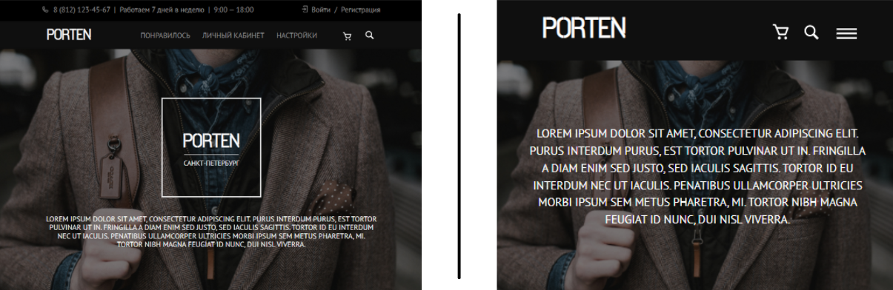

# PORTEN landing page

Landing page of a men's store. The design of the page is made according to the [layout](https://www.figma.com/file/xHjAxd90oUnfpTQ5NZnSoz/Templates-%2317.-More-on-Figma.info?node-id=0%3A1).

## Demo

 View this page in action [here](https://likorsi.github.io/porten/).

## Build with

- HTML5
- CSS3
- JavaScript
- Google Fonts
- WebStorm

### Features

- Adaptive, cross-browser and semantic layout
- Desktop, tablet and mobile versions
- Pure css with variables and media expressions

Use thе links to check the correctness of code using W3C services:

- [CSS](https://jigsaw.w3.org/css-validator/validator?uri=https%3A%2F%2Flikorsi.github.io%2Fporten%2F&profile=css3svg&usermedium=all&warning=1&vextwarning=)
- [HTML](https://validator.w3.org/nu/?showsource=yes&showoutline=yes&doc=https%3A%2F%2Flikorsi.github.io%2Fporten%2F)
